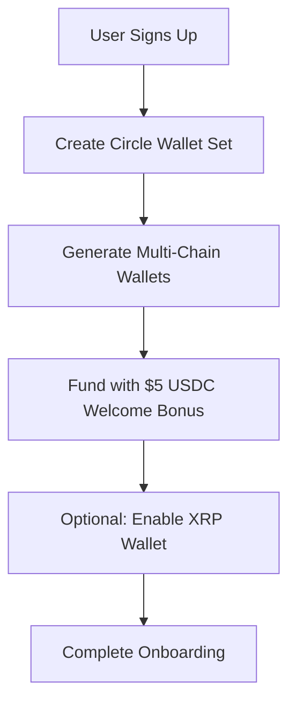

# Circle USDC Ecosystem Integration Plan
## Comprehensive Technical Architecture & Implementation Strategy

### Status: Research & Planning Phase
**Date**: January 11, 2025
**Circle API Status**: ✅ Live API Key Configured (LIVE_API_KEY:c017)

---

## 🎯 Strategic Overview

### Core Objectives
- **Default Programmable Wallets**: Circle wallets as primary user wallet solution
- **XRP Secondary Option**: Maintain XRP for ultra-low fee cross-border payments
- **Seamless UX**: Web2-like experience with Web3 benefits
- **Revenue Optimization**: Multiple USDC-based revenue streams

### Architecture Philosophy
- **Developer-Controlled Wallets**: Seamless user experience without complex private key management
- **Multi-Chain Support**: Ethereum, Polygon, Avalanche, Arbitrum integration
- **Hybrid Payment System**: USDC for stability, XRP for specialized use cases
- **Enterprise Security**: MPC key management with Circle infrastructure

---

## 🏗️ Technical Architecture

### 1. Circle SDK Integration
```javascript
// Core Dependencies
@circle-fin/user-controlled-wallets  // User wallet SDK
@circle-fin/developer-controlled-wallets  // Server-side wallet management
@circle-fin/web3-services  // Blockchain infrastructure

// Configuration
CIRCLE_API_KEY=LIVE_API_KEY:c017  // ✅ Already configured
CIRCLE_CLIENT_KEY=<client-key>     // ✅ Already configured
CIRCLE_ENTITY_SECRET=<generated>   // Will be created during first wallet set
```

### 2. Wallet Architecture
```typescript
interface CoinRailzWallet {
  // Primary Wallet (Default)
  circleWallet: {
    walletId: string;
    walletSetId: string;
    address: string;
    blockchain: 'ETH' | 'MATIC' | 'AVAX' | 'ARB';
    accountType: 'SCA' | 'EOA';
    balances: {
      USDC: number;
      ETH: number;
      MATIC: number;
      AVAX: number;
    };
  };
  
  // Secondary Wallet (Optional)
  xrpWallet?: {
    address: string;
    balance: number;
    isEnabled: boolean;
  };
  
  // Wallet Preferences
  preferences: {
    defaultPaymentMethod: 'USDC' | 'XRP';
    enableXRP: boolean;
    gasPaymentMethod: 'USDC' | 'ETH';
  };
}
```

### 3. Service Layer Architecture
```typescript
// Core Services
class CircleWalletService {
  // Wallet Management
  async createUserWallet(userId: string): Promise<CoinRailzWallet>;
  async getWalletBalance(walletId: string): Promise<WalletBalance>;
  async transferUSDC(params: TransferParams): Promise<Transaction>;
  
  // Multi-Chain Operations
  async bridgeToChain(params: BridgeParams): Promise<Transaction>;
  async estimateGasFees(params: FeeParams): Promise<FeeEstimate>;
  async sponsorTransaction(params: SponsorParams): Promise<Transaction>;
}

class CirclePaymentService {
  // Payment Processing
  async processP2PTransfer(params: P2PParams): Promise<Payment>;
  async processMarketplacePayment(params: MarketplaceParams): Promise<Payment>;
  async processRecurringPayment(params: RecurringParams): Promise<Payment>;
  
  // Revenue Generation
  async calculatePlatformFees(amount: number): Promise<FeeBreakdown>;
  async collectPlatformRevenue(transactionId: string): Promise<Revenue>;
}
```

---

## 💳 Payment Flow Integration

### 1. User Registration Flow


### 2. Payment Method Priority
```typescript
const paymentMethods = {
  primary: {
    USDC_Transfer: {
      fee: '0.25%',
      settlementTime: '3-5 seconds',
      supportedChains: ['ETH', 'MATIC', 'AVAX', 'ARB']
    }
  },
  secondary: {
    XRP_Transfer: {
      fee: '0.1%',
      settlementTime: '3-5 seconds',
      useCase: 'Cross-border payments'
    }
  },
  traditional: {
    PayPal: { fee: '2.9% + $0.30' },
    Stripe: { fee: '2.9% + $0.30' },
    CreditCard: { fee: '2.9% + $0.30' }
  }
};
```

### 3. Gas Station Implementation
```typescript
class GasStationService {
  async sponsorTransaction(params: {
    walletId: string;
    transaction: Transaction;
    payInUSDC: boolean;
  }): Promise<SponsoredTransaction> {
    // Calculate gas fees
    const gasFee = await this.estimateGas(params.transaction);
    
    // Convert to USDC if requested
    if (params.payInUSDC) {
      const usdcAmount = await this.convertToUSDC(gasFee);
      return this.deductUSDCForGas(params.walletId, usdcAmount);
    }
    
    // Platform sponsors gas (revenue opportunity)
    return this.sponsorGas(params.transaction, gasFee * 1.05); // 5% markup
  }
}
```

---

## 🔗 API Implementation Plan

### 1. Core Wallet APIs
```typescript
// Wallet Management Endpoints
POST /api/circle/wallets/create
GET  /api/circle/wallets/:userId
POST /api/circle/wallets/:walletId/transfer
GET  /api/circle/wallets/:walletId/transactions
POST /api/circle/wallets/:walletId/bridge

// Multi-Chain Operations
GET  /api/circle/chains/supported
POST /api/circle/chains/bridge
GET  /api/circle/chains/:chainId/gas-price
POST /api/circle/gas-station/sponsor
```

### 2. Payment Integration APIs
```typescript
// P2P Transfer Integration
POST /api/payments/p2p/usdc-transfer
POST /api/payments/marketplace/usdc-payment
POST /api/payments/recurring/usdc-subscription

// Revenue Collection
GET  /api/revenue/platform-fees
POST /api/revenue/collect-fees
GET  /api/analytics/usdc-volume
```

### 3. Admin & Analytics APIs
```typescript
// Platform Management
GET  /api/admin/circle/wallet-sets
GET  /api/admin/circle/monthly-active-wallets
GET  /api/admin/circle/revenue-report
POST /api/admin/circle/bulk-operations
```

---

## 📊 Revenue Model Integration

### 1. Circle-Based Revenue Streams
```typescript
const revenueStreams = {
  monthlyActiveWallets: {
    firstThousand: 0, // Free
    additional: 0.05, // $0.05 per MAW
    projected: 10000, // 10K MAW
    monthlyRevenue: 450 // (10K - 1K) * $0.05
  },
  
  gasStation: {
    markup: 0.05, // 5% on gas fees
    estimatedVolume: 50000, // Monthly transactions
    avgGasFee: 0.003, // ETH
    monthlyRevenue: 7500 // 50K * $0.003 * 1.05 * current_ETH_price
  },
  
  platformFees: {
    usdcTransfers: 0.0025, // 0.25%
    crossChainBridge: 0.005, // 0.5%
    merchantPayments: 0.0075, // 0.75%
    estimatedVolume: 2000000, // $2M monthly
    monthlyRevenue: 15000 // $2M * 0.75%
  }
};
```

### 2. Competitive Advantages
- **Lower Fees**: USDC transfers cheaper than traditional methods
- **Instant Settlement**: 3-5 seconds vs days for traditional banking
- **Global Reach**: No geographic restrictions or currency conversion
- **Programmable**: Smart contract integration for complex payment flows

---

## 🚀 Implementation Phases

### Phase 1: Foundation (Weeks 1-2)
- [ ] Install Circle SDK dependencies
- [ ] Create Circle service layer
- [ ] Implement wallet set creation
- [ ] Generate and secure Entity Secret
- [ ] Create basic USDC wallet for new users

### Phase 2: Core Integration (Weeks 3-4)
- [ ] Integrate USDC transfers into P2P system
- [ ] Add USDC payment option to AI marketplace
- [ ] Implement transaction history and monitoring
- [ ] Create wallet balance management

### Phase 3: Advanced Features (Weeks 5-6)
- [ ] Multi-chain wallet support
- [ ] Gas station implementation
- [ ] Cross-chain bridge integration
- [ ] Smart contract interaction capabilities

### Phase 4: Revenue Optimization (Weeks 7-8)
- [ ] Platform fee collection automation
- [ ] Monthly Active Wallet tracking
- [ ] Revenue analytics dashboard
- [ ] Performance optimization

### Phase 5: Enterprise Features (Weeks 9-10)
- [ ] USDC debit card integration
- [ ] Merchant payment gateway
- [ ] Bulk payment processing
- [ ] Regulatory compliance features

---

## 🔒 Security & Compliance

### 1. Key Management
```typescript
const securityConfig = {
  mpcSetup: {
    nodes: 2,
    hostedBy: 'Circle',
    controlledBy: 'Developer',
    entitySecret: 'Customer-managed'
  },
  
  walletTypes: {
    primary: 'Developer-controlled SCA',
    backup: 'User-controlled EOA',
    recovery: 'Multi-sig governance'
  },
  
  compliance: {
    kycRequired: false, // For amounts < $3,000
    amlScreening: true,
    transactionLimits: {
      daily: 10000,
      monthly: 50000
    }
  }
};
```

### 2. Risk Management
- **Transaction Monitoring**: Real-time fraud detection
- **Compliance Screening**: AML/KYC integration
- **Operational Security**: Key rotation and backup procedures
- **Audit Trail**: Comprehensive transaction logging

---

## 🎯 Success Metrics

### Technical KPIs
- **Wallet Creation Success Rate**: >99%
- **Transaction Success Rate**: >99.9%
- **Average Settlement Time**: <5 seconds
- **System Uptime**: >99.99%

### Business KPIs
- **Monthly Active Wallets**: 10,000+ (Target)
- **USDC Transaction Volume**: $2M+ monthly
- **Revenue per User**: $15+ monthly
- **Customer Acquisition Cost**: <$25

### User Experience KPIs
- **Onboarding Completion Rate**: >85%
- **Transaction Completion Rate**: >95%
- **User Satisfaction Score**: >4.5/5
- **Support Ticket Volume**: <2% of transactions

---

## 🔧 Development Environment Setup

### Required Dependencies
```json
{
  "dependencies": {
    "@circle-fin/user-controlled-wallets": "^1.0.0",
    "@circle-fin/developer-controlled-wallets": "^1.0.0",
    "@circle-fin/web3-services": "^1.0.0",
    "ethers": "^6.0.0",
    "web3": "^4.0.0"
  }
}
```

### Environment Configuration
```bash
# Circle Configuration
CIRCLE_API_KEY=LIVE_API_KEY:c017
CIRCLE_CLIENT_KEY=<client-key>
CIRCLE_ENTITY_SECRET=<generated-during-setup>
CIRCLE_WEBHOOK_SECRET=<webhook-validation>

# Blockchain Configuration
ETHEREUM_RPC_URL=<mainnet-url>
POLYGON_RPC_URL=<polygon-url>
AVALANCHE_RPC_URL=<avalanche-url>
ARBITRUM_RPC_URL=<arbitrum-url>
```

---

## 📝 Next Steps

### Immediate Actions
1. **Review Documentation**: Complete Circle API documentation review
2. **Architecture Approval**: Validate technical architecture with stakeholders
3. **Resource Planning**: Allocate development resources for 10-week implementation
4. **Testing Environment**: Set up Circle testnet environment

### Decision Points
- **Wallet Control Model**: Developer-controlled vs User-controlled
- **Chain Priority**: Which blockchain to launch first
- **Revenue Model**: Fee structure and pricing strategy
- **Compliance Level**: KYC requirements and geographic restrictions

### Risk Mitigation
- **Testnet Validation**: Comprehensive testing before mainnet deployment
- **Gradual Rollout**: Phased user migration from existing wallets
- **Backup Systems**: Maintain existing payment methods during transition
- **Performance Monitoring**: Real-time system health and transaction monitoring

---

*This document serves as the comprehensive technical blueprint for integrating Circle's USDC ecosystem into the Coin Railz platform. All implementation details are subject to final architectural review and stakeholder approval.*